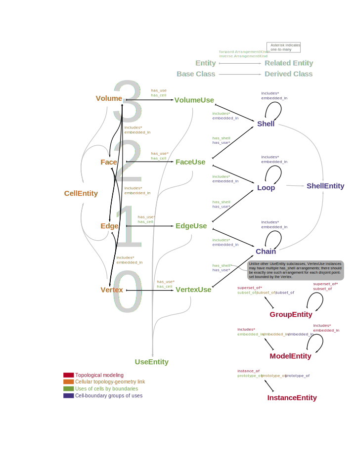

*****************************
SMTK's Geometric Model System
*****************************

SMTK's second major component is its geometric modeling system,
which provides bridges to multiple solid modeling kernels.

Key Concepts
============

Like the attribute system, the model system is composed of C++ classes,
also accessible in Python, whose instances perform the following functions:

:smtk:`Manager <smtk::model::Manager>`
  instances that contain model topology and geometry.
  All of the model entities such as faces, edges, and vertices are
  assigned a UUID by SMTK.
  You can think of the manager as a key-value store from UUID values to
  model entities, their properties, their arrangement with other entities,
  their ties to the attribute system, and their tessellations.

:smtk:`Bridge <smtk::model::Bridge>`
  instances relate entries in a model Manager to a solid modeling kernel.
  You can think of the entities in a model Manager as being "backed" by
  a solid modeling kernel; the bridge provides a way to synchronize
  the representations in the Manager and the modeling kernel.
  A manager may contain entity records from multiple Bridge sessions
  (e.g., a single Manager may contain some models back by an ACIS
  modeling kernel bridge and some backed by OpenCascade bridge).

:smtk:`Operator <smtk::model::Operator>`
  instances represent modeling operations that a modeling kernel
  provides for marking up, modifying, or even generating modeling entities
  from scratch.
  Operators usually require the entries in the model Manager to be
  updated after they are executed (in the solid modeling kernel).
  Each operator implements a method to invoke its operation in the modeling kernel
  and owns an attribute system Attribute instance (its *specification*) to store
  the parameters required by the operation.
  SMTK expects the primary operand of an operator (e.g., a set of edge entities
  in the model manager to be swept into a face) to be model entities
  **associated** with the operator's specification.
  Other operands (e.g., the geometric path along which to sweep a set of edges)
  are stored as key-value Items in the specification.

:smtk:`Cursor <smtk::model::Cursor>`
  instances are lightweight references into a model Manager's storage
  that represent a single entity (e.g., a vertex, edge, face, or volume)
  and provide methods for easily accessing related entities, properties,
  tessellation data, and attributes associated with that entity.
  They also provide methods for manipulating the model Manager's storage
  but *these methods should not be used directly*; instead use an Operator
  instance to modify the model so that the kernel and manager stay in sync.
  Cursor subclasses include Vertex, Edge, Face, Volume, ModelEntity,
  GroupEntity, UseEntity, Loop, Shell, and so on. These are discussed
  in detail in `Model Entities`_ below.

:smtk:`DescriptivePhrase <smtk::model::DescriptivePhrase>`
  instances provide a uniform way to present model entities and the information
  associated with those entities to users.
  There are several subclasses of this class that present an entity,
  a set of entities, an entity's property, and a set of entity properties.
  Each phrase may have 1 parent and multiple children;
  thus, phrases can be arranged into a tree structure.

:smtk:`SubphraseGenerator <smtk::model::SubphraseGenerator>`
  instances accept a DescriptivePhrase instance and enumerate its children.
  This functionality is separated from the DescriptivePhrase class so that
  different user-interface components can use the same set of phrases but
  arrange them in different ways.
  For example, a model-overview widget might subclass the subphrase generator
  to only enumerate sub-models and sub-groups of the entity in its input
  DescriptivePhrase; while a model-detail widget might include volumes, faces,
  edges, and vertices when passed a DescriptivePhrase for a model.

Model Entities
==============

As mentioned above, the model :smtk:`Manager <smtk::model::Manager>` class is the only place where
model topology and geometry are stored in SMTK.
However, there are cursor-like classes, all derived from :smtk:`smtk::model::Cursor`,
that provide easier access to model traversal.
These classes are organized like so:

   Each of the orange, green, purple, and red words is the name of a cursor class.
   The black arrows show relationships between instances of them (for which the
   classes at both ends provide accessors).

Each relationship shown in the figure above has a corresponding
method in the cursor subclasses for accessing the related entities.

Remote models
=============

For many reasons (e.g., incompatible library dependencies, licensing issues, distributed processing),
it is often necessary for the modeling kernel to live in a different process than other portions of
the simuation pipline.

.. figure:: figures/forwarding-bridge.svg

   The CMB client-server model uses SMTK's RemoteOperator and DefaultBridge classes to
   forward operations from the client to the server (and results back to the client).
